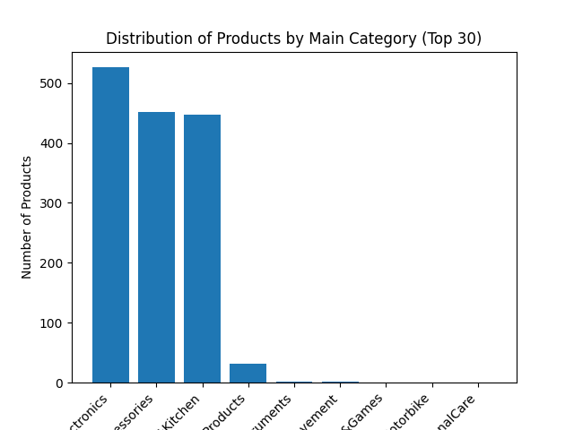
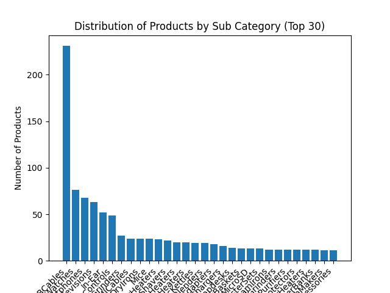
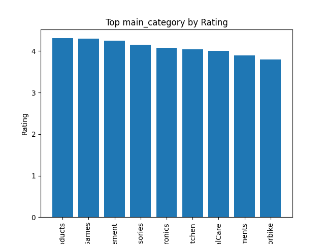
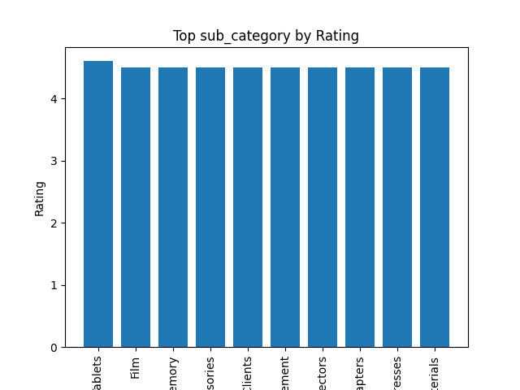
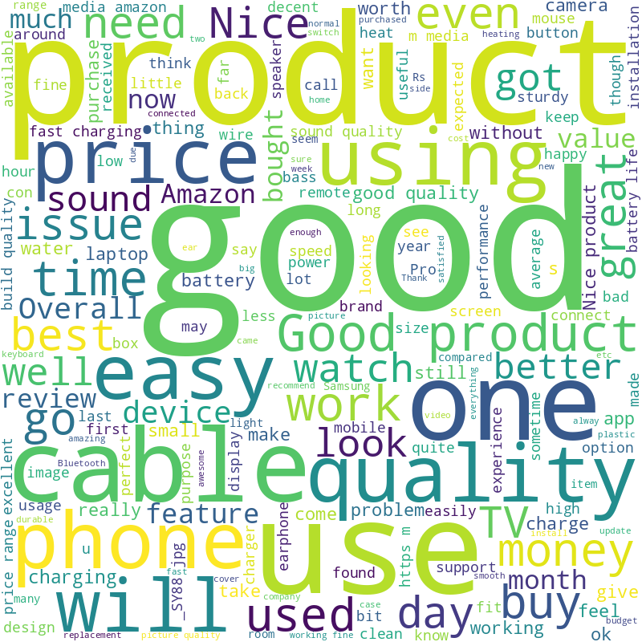
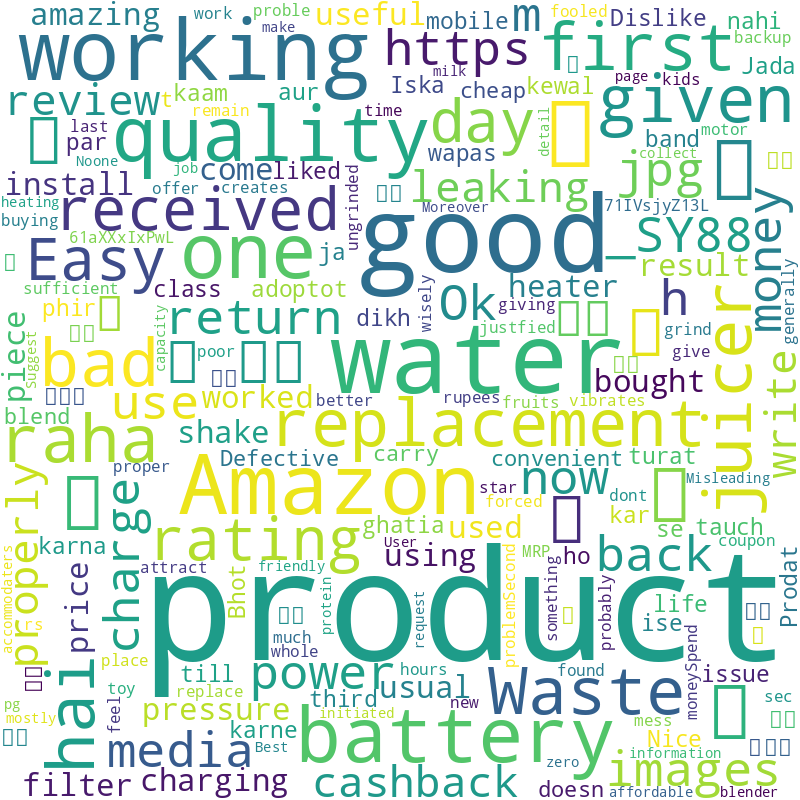

# Data Analysis Summary

## Introduction
This data analysis project explores the dataset containing information about AWS sales data. The analysis covers data collection, cleaning, and exploratory data analysis (EDA).

## Data Overview
The dataset consists of the following columns:
## Data Overview

The dataset contains the following columns:

- **product_id:** Identifier for each product.
- **product_name:** Name of the product.
- **category:** Category to which the product belongs.
- **discounted_price:** Price of the product after applying discounts.
- **actual_price:** Original price of the product without any discounts.
- **discount_percentage:** Percentage of discount applied to the product.
- **rating:** Average rating of the product based on user reviews.
- **rating_count:** Number of user ratings for the product.
- **about_product:** Description or information about the product.
- **user_id:** Identifier for each user.
- **user_name:** Name of the user providing the review.
- **review_id:** Identifier for each review.
- **review_title:** Title of the review.
- **review_content:** Detailed content of the review.
- **img_link:** Link to an image associated with the product.
- **product_link:** Link to the product page.
- **rating_weighted:** Weighted rating of the product based on certain criteria.
- **sub_category:** Sub-category to which the product belongs.
- **main_category:** Main category to which the product belongs.

## Key Findings

### Main Caegory Distribution

Based on the results, we can gather the following insights:

- The top three main categories are Electronics, Computers & Accessories, and Home & Kitchen. This shows that these categories are popular among customers.

- The number of products in the other main categories is quite low, indicating that these categories are not as popular as the top three.

- Office Products, Musical Instruments, Home Improvement, Toys & Games, Car & Motorbike, and Health & Personal Care have a very small number of products, which may suggest that these categories have less demand.

- Overall, the data can help businesses understand the current market trends and identify potential opportunities for growth in specific categories.

### Sub Category Distribution

Based on the results, we can gather the following insights:

- The top six subcategories are USB cables, smartwatches, smartphones, smart televisions, in-ear headphones, and remote controls. These are the most popular subcategories, and businesses could focus on providing products in these categories to attract customers.

- Other popular subcategories include mixer grinders, HDMI cables, dry irons, mice, and instant water heaters. These subcategories may be less popular than the top six, but they still have a significant number of products, indicating that there is demand for them.

- The data shows that there is a diverse range of subcategories in the top 30, including kitchen appliances, home electronics, and personal accessories. This highlights the importance of offering a variety of products to cater to different customer needs and preferences.

- Overall, the data can help businesses identify the most popular subcategories and adjust their product offerings to meet customer demand. By focusing on these subcategories, businesses could increase their sales and improve their competitiveness in the market.

### Top main and sub-category by rating Distribution

The majority of customer ratings fall within the 3-4 and 4-5 range, with a total of 1453 reviews.

There is a noticeable increase in the number of reviews in the 2-3 range compared to the lower 0-1 and 1-2 ranges.

The lowest number of reviews is found in the 0-1 range, indicating that there may be room for improvement in terms of customer satisfaction.

Overall, the distribution of customer ratings suggests that most customers are satisfied with the products, but there may be opportunities for improvement to increase the number of positive ratings.

Looking at the table, we can see the top and bottom sub-categories in terms of customer ratings.

It's great to see that the "Tablets" sub-category is at the top with a rating of 4.6, which indicates that customers are satisfied with their purchase.

However, there are some sub-categories at the bottom, such as "DustCovers" and "ElectricGrinders", which have lower ratings, implying that customers are not very happy with these products.

Insights like these can help businesses focus on improving the quality of their products and enhancing the overall customer experience. It's important to keep track of customer feedback to identify areas for improvement and continue to meet their needs and expectations.

### Review positive and negative sentiment Distribution

The code generates a word cloud based on the reviews text in the dataset, allowing us to visually analyze the most common words used in the reviews. The larger the word in the cloud, the more frequently it appears in the reviews. This can provide insights into the overall sentiment of the customers, the most frequently mentioned product features or issues, and other important information that can help businesses improve their products and services. In the following example, you can see the word cloud for products with a rating greater than 4

### Additional Insights
- The majority of individuals in the dataset are in their 30s.
- The cities of residence vary across New York, San Francisco, and Los Angeles.

## Conclusion
This analysis provides a basic understanding of the dataset, highlighting key statistics and trends. Further analysis and modeling could be pursued based on these initial findings.

For more details, refer to the full Jupyter Notebooks in the `notebooks/` directory.

---

*Note: This is a template, and you should customize it based on the specifics of your analysis and findings.*
